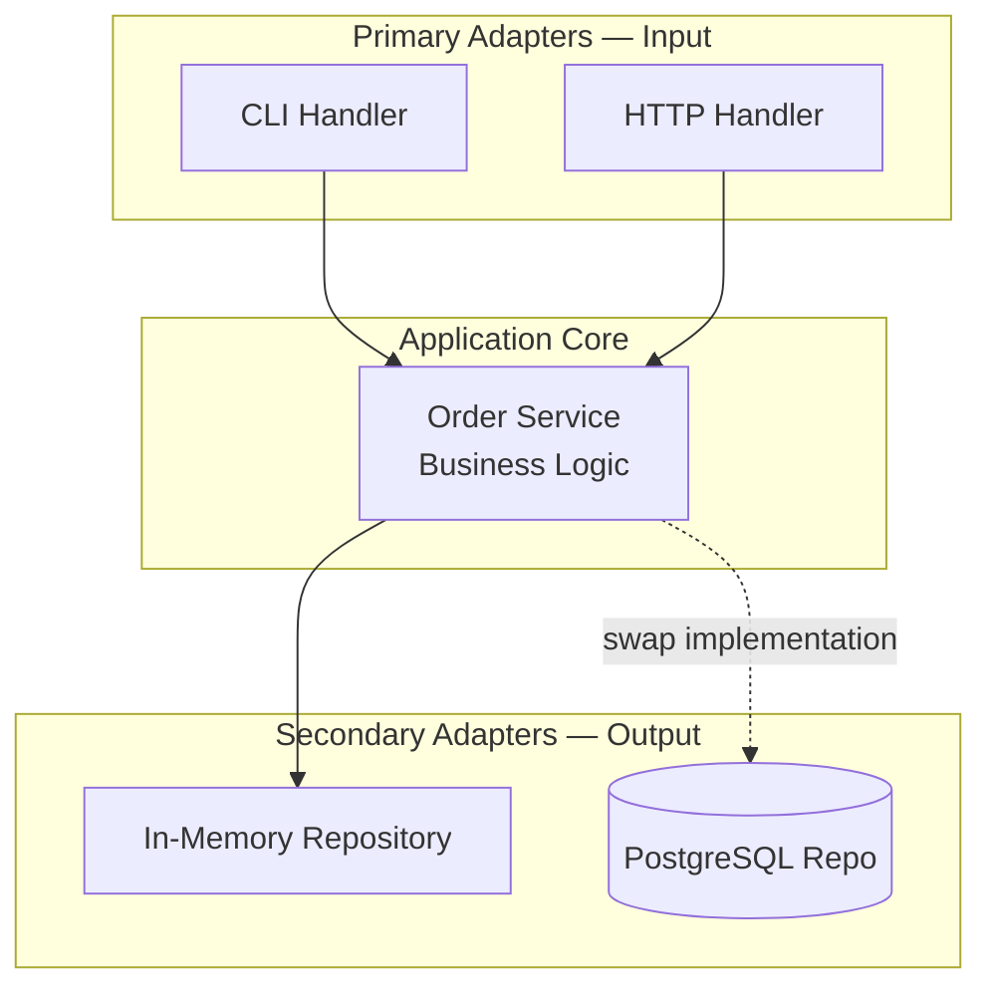

# 09. Backend Architecture

> **Time:** 5–6 hours | **Prerequisites:** [Module 08](../08_advanced_go_patterns/README.md)

Writing code is easy; architecting maintainable systems is hard. Learn Clean Architecture and Hexagonal patterns.

> Full guide: [docs/ARCHITECTURE.md](../docs/ARCHITECTURE.md)

---

## Step-by-Step

1. `go run main.go` — see hexagonal order flow
2. Read `main.go` in order: Domain → Port → Service → Adapter → Wiring
3. Complete [exercises/EXERCISES.md](./exercises/EXERCISES.md)
4. Checkpoint: draw layers on paper before Module 10

---

## Architecture in This Module



---

## Topics Covered

1. **Clean Architecture (Uncle Bob)** — separating concerns into layers
2. **Hexagonal Architecture (Ports & Adapters)** — decoupling core logic from infrastructure
3. **Domain-Driven Design (DDD)** — modeling software after business domains
4. **Dependency Injection** — managing dependencies explicitly via interfaces

---

## Running the Example

Hexagonal architecture demo — order processing system:

```bash
go run main.go
```

Expected output:
```
=== 09 Backend Architecture (Hexagonal) ===
💾 Database: Saved order ORD-101 with amount 99.99
✅ Order created successfully
❌ Error: amount must be positive
```

---

## Code Walkthrough

### Layer 1: Domain (Core)

```go
type Order struct {
    ID        string
    Amount    float64
    CreatedAt time.Time
}
```

Pure business entity — no framework imports.

### Layer 2: Port (Interface)

```go
type OrderRepository interface {
    Save(order Order) error
}
```

Contract that the core depends on — not the implementation.

### Layer 3: Use Case (Application Logic)

```go
type OrderService struct {
    repo OrderRepository  // depends on interface, not concrete type
}
```

### Layer 4: Adapter (Infrastructure)

```go
type InMemoryOrderRepo struct { ... }  // implements OrderRepository
type CLIHandler struct { ... }          // primary adapter (entry point)
```

---

## Key Principle: Dependency Rule

```
Dependencies always point INWARD:

  Adapters → Ports (interfaces) → Domain

  ❌ Domain should NEVER import Gin, PostgreSQL, or HTTP packages
  ✅ Adapters import Domain
```

---

## Exercises

1. **Swap the repository** — create a `PostgresOrderRepo` that implements `OrderRepository`
2. **Add HTTP adapter** — create an HTTP handler (Gin) as a primary adapter
3. **Add validation** — move business rules (amount > 0) into the domain entity
4. **Add a new use case** — implement `CancelOrder` in the service

---

## Checkpoint

Before moving to Module 10, you should be able to:

- [ ] Draw the layers: Domain → Use Case → Adapter
- [ ] Explain why the core doesn't import frameworks
- [ ] Implement dependency injection with interfaces
- [ ] Swap a repository without changing business logic

---

## Next Steps

- [Module 10 — Microservices](../10_microservices/README.md)
- [Full Architecture Guide](../docs/ARCHITECTURE.md)
- [Capstone Projects](../15_capstone_projects/README.md)
