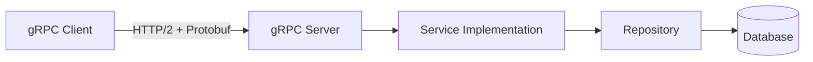
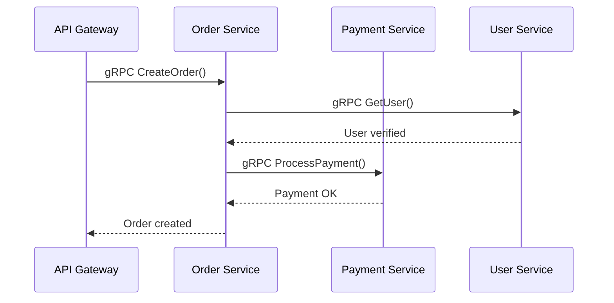

# 10. Microservices with gRPC

Microservices require efficient, typed communication between services. This module introduces **gRPC** and **Protocol Buffers**.

> Full guide: [docs/MICROSERVICES.md](../docs/MICROSERVICES.md)
> Architecture: [docs/ARCHITECTURE.md](../docs/ARCHITECTURE.md)

---

## Architecture Overview



---

## Topics Covered

1. **gRPC vs REST** — when to use each
2. **Protocol Buffers (.proto)** — defining service contracts
3. **Code Generation** — `protoc` to generate Go code
4. **gRPC Server & Client** — implementing services
5. **Service Discovery** — K8s DNS, Consul
6. **Resilience** — circuit breakers, retries, timeouts

---

## Prerequisites

Install `protoc` and Go plugins:

```bash
go install google.golang.org/protobuf/cmd/protoc-gen-go@latest
go install google.golang.org/grpc/cmd/protoc-gen-go-grpc@latest
```

---

## Running the Example

The example includes a simple Greeter service using gRPC's helloworld proto.

```bash
# Terminal 1 — Start Server
go run server/main.go

# Terminal 2 — Run Client
go run client/main.go
```

Expected output:
```
server listening at [::]:50051
Received: world
Hello world
```

---

## Project Structure

```
10_microservices/
├── server/
│   └── main.go          # gRPC server implementation
├── client/
│   └── main.go          # gRPC client calling server
├── go.mod
└── README.md
```

---

## Key Concepts

### gRPC vs REST

| Feature | gRPC | REST |
| :--- | :--- | :--- |
| Protocol | HTTP/2 + Protobuf (binary) | HTTP/1.1 + JSON (text) |
| Performance | Faster, smaller payloads | Slower, human-readable |
| Contract | `.proto` file (strict) | OpenAPI (optional) |
| Streaming | Built-in (4 types) | Limited (SSE, WebSocket) |
| Best for | Internal service-to-service | Public APIs, browsers |

### Communication in Microservices



---

## Exercises

1. **Define your own `.proto`** — create an `OrderService` with `CreateOrder` and `GetOrder` RPCs
2. **Add error handling** — return proper gRPC status codes (`codes.NotFound`, `codes.InvalidArgument`)
3. **Add middleware** — implement a logging interceptor for the gRPC server
4. **Add timeout** — use `context.WithTimeout` on the client side

---

## Checkpoint

Before moving to Module 11, you should be able to:

- [ ] Explain why gRPC is preferred for internal service communication
- [ ] Write a `.proto` file and generate Go code
- [ ] Implement both server and client
- [ ] Handle errors with gRPC status codes
- [ ] Explain circuit breaker pattern

---

## Next Steps

- [Module 11 — Cloud Native Go](../11_cloud_native_go/README.md)
- [Full Microservices Guide](../docs/MICROSERVICES.md)
- [Capstone: E-Commerce Microservices](../15_capstone_projects/README.md)
