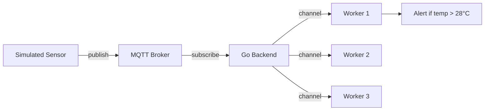

# 12. IoT Backend Projects

> **Time:** 4–5 hours | **Prerequisites:** [Module 11](../11_cloud_native_go/README.md), [Module 03](../03_concurrency_and_context/README.md)

Build IoT backends with MQTT, worker pools, and real-time sensor data processing.

---

## What You Will Learn

- [ ] MQTT publish/subscribe pattern
- [ ] Sensor data simulation
- [ ] Worker pool for message processing (from Module 03)
- [ ] Alert logic (threshold-based)
- [ ] Context-based graceful shutdown

---

## Architecture



---

## Step-by-Step Lessons

### Step 1 — Run the backend

```bash
cd 12_iot_backend_projects
go mod tidy
go run main.go
```

Runs for 15 seconds, then exits. You'll see:
- Sensor publishing temperature every 2 seconds
- Workers processing readings
- Alert when temperature > 28°C

### Step 2 — Understand the flow

1. `publishSensorData()` — simulates IoT device
2. MQTT subscribe callback — receives messages, sends to channel
3. `processor()` workers — read from channel, check thresholds

### Step 3 — Experiment

Change alert threshold in `processor()` from `28.0` to `25.0` and re-run.

---

## Exercises

See [exercises/EXERCISES.md](./exercises/EXERCISES.md)

---

## Checkpoint

Before Module 13:

- [ ] Explain MQTT pub/sub model
- [ ] Connect worker pool to message channel
- [ ] Implement threshold alerting

---

## Next Module

→ [13 Docker & Kubernetes](../13_docker_and_kubernetes/README.md)
