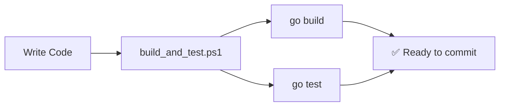

# 14. CI/CD Pipeline (Local)

> **Time:** 2–3 hours | **Prerequisites:** [Module 13](../13_docker_and_kubernetes/README.md)

Learn CI/CD concepts and run automated tests **locally** — no GitHub Actions required.

---

## What You Will Learn

- [ ] Continuous Integration (CI) concepts
- [ ] Automated `go test` before every commit
- [ ] golangci-lint for code quality
- [ ] Local build scripts (PowerShell / Bash)

---

## How CI Works (Local)



**No cloud CI needed** — run tests on your machine before `git push`.

---

## Step-by-Step Lessons

### Step 1 — Run all modules locally

From repo root (Windows):

```powershell
.\build_and_test.ps1
```

### Step 2 — Test single module

```bash
cd 14_ci_cd_pipeline
go test -v ./...
```

### Step 3 — Run linter (optional)

```bash
go install github.com/golangci/golangci-lint/cmd/golangci-lint@latest
cd 14_ci_cd_pipeline
golangci-lint run
```

### Step 4 — Your pre-commit habit

Before every push:
```powershell
.\build_and_test.ps1
git add .
git commit -m "your message"
git push
```

---

## Reference Files

| File | Purpose |
| :--- | :--- |
| `build_and_test.ps1` | Build + run all modules locally |
| `ci.yml` | Example workflow file (reference only, not active) |

---

## Exercises

See [exercises/EXERCISES.md](./exercises/EXERCISES.md)

---

## Checkpoint

Before Module 15:

- [ ] Explain what CI does and why it matters
- [ ] Run `build_and_test.ps1` successfully
- [ ] Run golangci-lint locally

---

## Next Module

→ [15 Capstone Projects](../15_capstone_projects/README.md)
