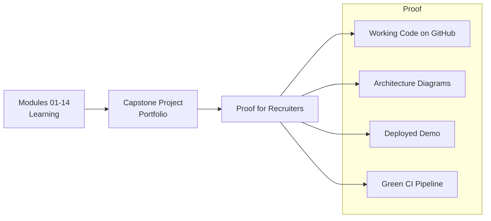
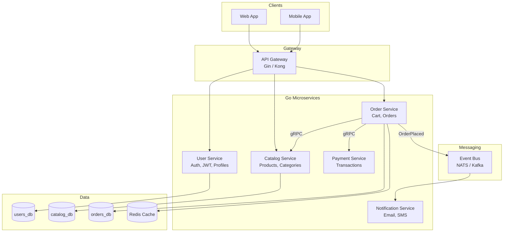
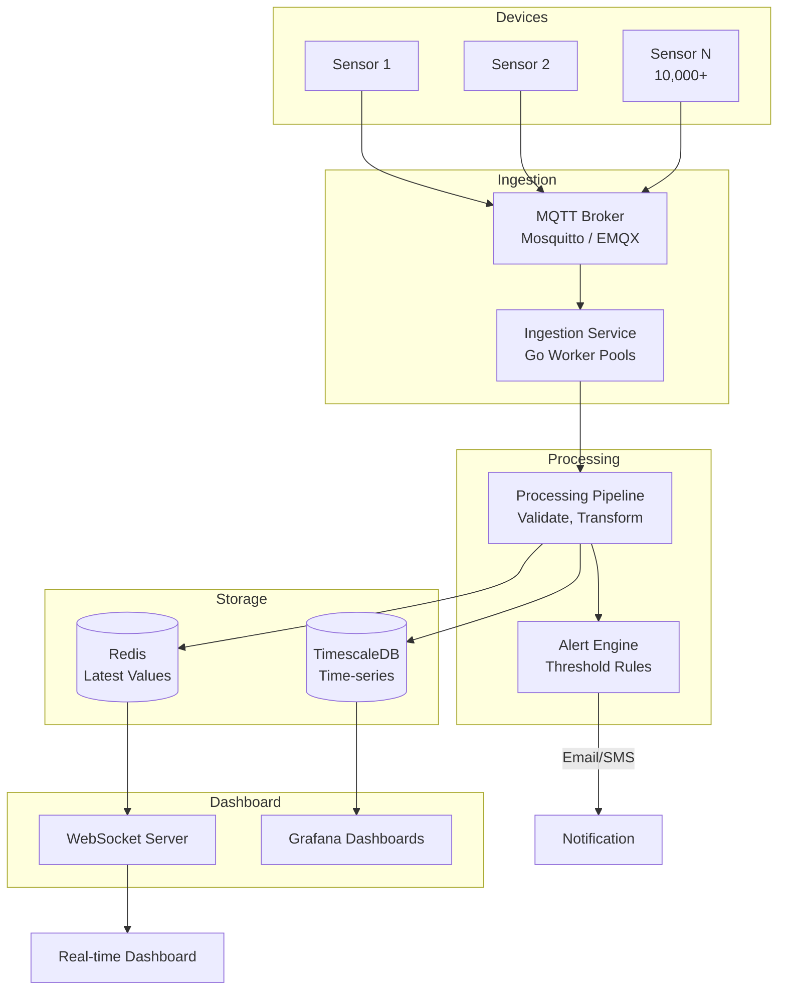

# 15. Capstone Projects

Put everything together. These projects are your **portfolio proof** — show recruiters you can build production systems.

> Track progress: [docs/PROGRESS.md](../docs/PROGRESS.md)
> Architecture reference: [docs/ARCHITECTURE.md](../docs/ARCHITECTURE.md)
> Skills matrix: [docs/SKILLS_MATRIX.md](../docs/SKILLS_MATRIX.md)
> **Build guide:** [HOW_TO_BUILD.md](./HOW_TO_BUILD.md) — week-by-week steps

---

## Why Capstone Matters



Recruiters don't hire based on tutorials completed. They hire based on **what you can build**. A capstone project proves:

- You understand architecture (not just syntax)
- You can integrate multiple technologies
- You write tests and use CI/CD
- You can deploy to production

---

## Project 1: Cloud-Native E-Commerce Microservices

**Difficulty:** Hard | **Time:** 2–4 weeks

### Architecture



### Services Breakdown

| Service | Responsibility | Protocol | Database |
| :--- | :--- | :--- | :--- |
| **User Service** | Registration, login, JWT, profiles | REST (public) | PostgreSQL |
| **Catalog Service** | Products, categories, search | gRPC (internal) | PostgreSQL |
| **Order Service** | Cart, place order, order history | REST + gRPC | PostgreSQL + Redis |
| **Payment Service** | Process payment (mock Stripe) | gRPC (internal) | PostgreSQL |
| **Notification Service** | Email/SMS on events | Event consumer | None |

### Tech Stack

| Layer | Technology |
| :--- | :--- |
| Language | Go 1.22+ |
| External API | REST (Gin) |
| Internal API | gRPC + Protobuf |
| Database | PostgreSQL (per service) |
| Cache | Redis |
| Events | NATS or Kafka |
| Container | Docker (multi-stage) |
| Orchestration | Kubernetes |
| CI/CD | GitHub Actions |
| Logging | Structured JSON (zerolog/zap) |
| Tracing | OpenTelemetry + Jaeger |

### Requirements Checklist

- [ ] 3+ independent Go services with separate `go.mod`
- [ ] gRPC communication between services
- [ ] REST API gateway for external clients
- [ ] JWT authentication (from Module 07)
- [ ] Clean Architecture per service (from Module 09)
- [ ] PostgreSQL with migrations per service
- [ ] Redis caching for hot data
- [ ] Event-driven: OrderPlaced → notification + inventory
- [ ] Docker image per service (< 20MB each)
- [ ] Kubernetes manifests (Deployment, Service, Ingress)
- [ ] GitHub Actions CI (test + lint + build)
- [ ] Health check endpoints (`/health`, `/ready`)
- [ ] Structured logging with request IDs
- [ ] README with architecture diagram

### Suggested Project Structure

```
ecommerce-platform/
├── services/
│   ├── user-service/
│   │   ├── cmd/api/main.go
│   │   ├── internal/domain/
│   │   ├── internal/usecase/
│   │   ├── internal/adapter/
│   │   ├── proto/
│   │   ├── Dockerfile
│   │   └── go.mod
│   ├── catalog-service/
│   ├── order-service/
│   ├── payment-service/
│   └── notification-service/
├── gateway/
│   └── cmd/api/main.go
├── deploy/
│   ├── docker-compose.yml
│   └── k8s/
│       ├── user-deployment.yaml
│       ├── order-deployment.yaml
│       └── ingress.yaml
├── .github/workflows/ci.yml
└── README.md
```

---

## Project 2: Real-Time IoT Data Platform

**Difficulty:** Hard | **Time:** 2–3 weeks

### Architecture



### Tech Stack

| Layer | Technology |
| :--- | :--- |
| Language | Go 1.22+ |
| Protocol | MQTT (Eclipse Paho) |
| Database | TimescaleDB (PostgreSQL extension) |
| Cache | Redis (latest sensor values) |
| Dashboard | Grafana + custom WebSocket UI |
| Container | Docker Compose |
| CI/CD | GitHub Actions |

### Requirements Checklist

- [ ] MQTT subscriber with worker pool (Module 03 + 12)
- [ ] Handle 10,000+ messages/second
- [ ] Store time-series data in TimescaleDB
- [ ] Redis for latest value per sensor
- [ ] WebSocket server for real-time dashboard
- [ ] Alert system: email/SMS when temperature > threshold
- [ ] Docker Compose for local development
- [ ] Grafana dashboard for historical data
- [ ] GitHub Actions CI
- [ ] README with architecture diagram

### Getting Started (Skeleton)

```bash
cd impl/iot-platform
go run main.go
```

---

## How to Present to Recruiters

After completing a capstone:

1. **GitHub repo** with clean commit history
2. **README** with:
   - Architecture diagram (mermaid)
   - How to run locally (`docker-compose up`)
   - Tech stack table
   - What you learned
3. **Live demo** — deploy to a free tier (Railway, Fly.io, or local K8s)
4. **LinkedIn post** — link repo, mention technologies
5. **Resume bullet:**
   ```
   Built e-commerce microservices platform in Go with gRPC,
   PostgreSQL, Redis, Kubernetes — 5 services, event-driven
   architecture, CI/CD with GitHub Actions
   GitHub: [link]
   ```

See: [docs/RECRUITER_GUIDE.md](../docs/RECRUITER_GUIDE.md)

---

## Evaluation Criteria (Self-Check)

| Criteria | Weight | Done? |
| :--- | :---: | :---: |
| Multiple services communicating | 20% | ⬜ |
| Proper architecture (Clean/Hexagonal) | 20% | ⬜ |
| Tests with CI passing | 15% | ⬜ |
| Docker + deployment config | 15% | ⬜ |
| Error handling & logging | 10% | ⬜ |
| README with diagrams | 10% | ⬜ |
| Can explain design decisions | 10% | ⬜ |

---

## Related Docs

- [ARCHITECTURE.md](../docs/ARCHITECTURE.md) — system design patterns
- [MICROSERVICES.md](../docs/MICROSERVICES.md) — gRPC, events, resilience
- [PROGRESS.md](../docs/PROGRESS.md) — full checklist
- [SKILLS_MATRIX.md](../docs/SKILLS_MATRIX.md) — skills demonstrated
