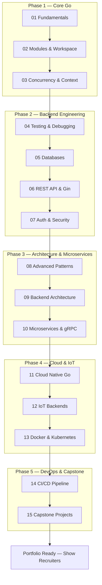
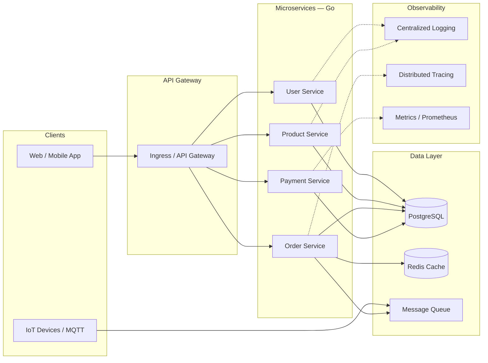
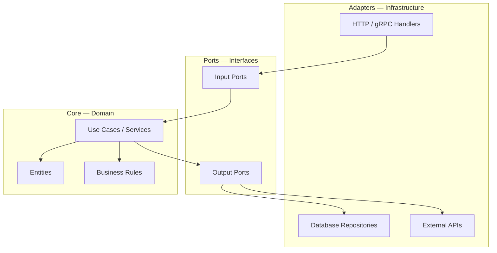
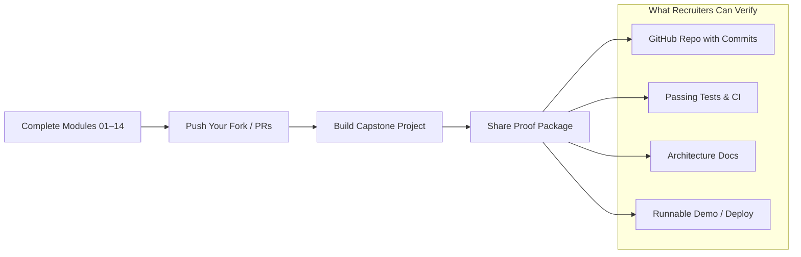

# Master Golang — Zero to Cloud-Native Backend Architect

[](https://go.dev/)
[](LICENSE)
[]()
[](http://makeapullrequest.com)

> **Professional Go learning platform — A to Z.**
> Learn backend development, microservices, cloud-native systems, and production architecture using idiomatic Go.
> Built so **learners can prove their skills** and **recruiters can verify them** through code, checklists, and capstone projects.

**👉 Start learning: [docs/START_HERE.md](docs/START_HERE.md) — follow modules 01 → 15 in order.**

---

## Who Is This For?

| Audience | What You Get |
| :--- | :--- |
| **Learners** | Step-by-step modules, runnable code, exercises, progress tracker |
| **Recruiters / Hiring Managers** | [Skills Matrix](docs/SKILLS_MATRIX.md), [Recruiter Guide](docs/RECRUITER_GUIDE.md), capstone proof-of-work |
| **Developers switching stacks** | Clean Architecture, gRPC, K8s — real patterns, not toy examples |

---

## Learning Journey (Basic → Advanced → Production)



---

## Full System Architecture (What You Will Build)



---

## Clean Architecture Layers (Module 09)



---

## Course Curriculum (15 Modules)

Each module has **README + runnable `main.go` + learning objectives**. Track progress in [docs/PROGRESS.md](docs/PROGRESS.md).

### Phase 1: Core Systems & Concurrency

| # | Module | Topic | Key Skills |
| :---: | :--- | :--- | :--- |
| 01 | [Go Fundamentals](./01_go_fundamentals) | Syntax, Types, Errors | Variables, structs, interfaces, `if err != nil` |
| 02 | [Modules & Workspace](./02_modules_and_workspace) | Dependency Management | `go.mod`, `go.work`, versioning |
| 03 | [Concurrency & Context](./03_concurrency_and_context) | Goroutines & Channels | WaitGroups, mutexes, worker pools, `context` |

### Phase 2: Modern Backend Engineering

| # | Module | Topic | Key Skills |
| :---: | :--- | :--- | :--- |
| 04 | [Testing & Debugging](./04_testing_and_debugging) | Quality Assurance | Table-driven tests, benchmarks, fuzzing |
| 05 | [Databases](./05_databases_sql_nosql) | Data Persistence | `database/sql`, GORM, Redis, migrations |
| 06 | [REST API & Gin](./06_rest_api_and_gin) | API Development | Gin, middleware, validation, OpenAPI |
| 07 | [Auth & Security](./07_authentication_and_security) | Security | JWT, OAuth2, RBAC, password hashing |

### Phase 3: Advanced Architecture & Microservices

| # | Module | Topic | Key Skills |
| :---: | :--- | :--- | :--- |
| 08 | [Advanced Patterns](./08_advanced_go_patterns) | Expert Go | Generics, functional options, reflection |
| 09 | [Backend Architecture](./09_backend_architecture) | System Design | Clean Architecture, Hexagonal, DDD |
| 10 | [Microservices](./10_microservices) | Distributed Systems | gRPC, Protobuf, service discovery |

### Phase 4: Cloud Native & IoT

| # | Module | Topic | Key Skills |
| :---: | :--- | :--- | :--- |
| 11 | [Cloud Native Go](./11_cloud_native_go) | Cloud SDKs | AWS/GCP, Lambda, object storage |
| 12 | [IoT Backends](./12_iot_backend_projects) | IoT Integration | MQTT, sensor ingestion, pipelines |
| 13 | [Docker & Kubernetes](./13_docker_and_kubernetes) | Deployment | Multi-stage builds, K8s manifests, Helm |

### Phase 5: DevOps & Capstones

| # | Module | Topic | Key Skills |
| :---: | :--- | :--- | :--- |
| 14 | [CI/CD Pipeline](./14_ci_cd_pipeline) | Automation | Local scripts, linting, pre-push testing |
| 15 | [Capstone Projects](./15_capstone_projects) | Production Projects | Full microservices backend, IoT platform |

---

## Quick Start (5 Minutes)

### Prerequisites

- [Go 1.22+](https://go.dev/dl/)
- [Docker](https://www.docker.com/) (for modules 13+)
- VS Code + [Go extension](https://marketplace.visualstudio.com/items?itemName=golang.go)

### Install & Run

```bash
git clone https://github.com/your-username/golang-learning.git
cd golang-learning

# Run first module
cd 01_go_fundamentals
go run main.go

# Verify all modules build (Windows)
cd ..
.\build_and_test.ps1
```

### Recommended Learning Order

1. Read [docs/INSTALL.md](docs/INSTALL.md) → [docs/GETTING_STARTED.md](docs/GETTING_STARTED.md)
2. Follow [docs/LEARNING_PATH.md](docs/LEARNING_PATH.md) module by module
3. Check off items in [docs/PROGRESS.md](docs/PROGRESS.md)
4. Complete [15_capstone_projects](./15_capstone_projects) for portfolio proof

---

## Prove Your Skills (For Learners & Recruiters)



| Document | Purpose |
| :--- | :--- |
| [docs/PROGRESS.md](docs/PROGRESS.md) | Self-assessment checklist — mark modules done |
| [docs/SKILLS_MATRIX.md](docs/SKILLS_MATRIX.md) | Skill-to-module mapping for interviews |
| [docs/RECRUITER_GUIDE.md](docs/RECRUITER_GUIDE.md) | How to evaluate a candidate using this repo |
| [docs/ARCHITECTURE.md](docs/ARCHITECTURE.md) | Full system design with diagrams |
| [docs/MICROSERVICES.md](docs/MICROSERVICES.md) | Microservices patterns A to Z |

---

## Repository Structure

```
golang-learning/
├── 01_go_fundamentals/          # Phase 1 — Core Go
├── 02_modules_and_workspace/
├── 03_concurrency_and_context/
├── 04_testing_and_debugging/    # Phase 2 — Backend
├── 05_databases_sql_nosql/
├── 06_rest_api_and_gin/
├── 07_authentication_and_security/
├── 08_advanced_go_patterns/     # Phase 3 — Architecture
├── 09_backend_architecture/
├── 10_microservices/
├── 11_cloud_native_go/          # Phase 4 — Cloud & IoT
├── 12_iot_backend_projects/
├── 13_docker_and_kubernetes/
├── 14_ci_cd_pipeline/           # Phase 5 — DevOps
├── 15_capstone_projects/
├── docs/                        # Guides, cheat sheets, progress
├── legacy/                      # Original beginner examples
└── build_and_test.ps1           # Verify all modules
```

See [docs/PROJECT_STRUCTURE.md](docs/PROJECT_STRUCTURE.md) for package layout best practices.

---

## Documentation Index

| Guide | Description |
| :--- | :--- |
| [docs/LEARNING_PATH.md](docs/LEARNING_PATH.md) | Complete A→Z learning roadmap |
| [docs/ARCHITECTURE.md](docs/ARCHITECTURE.md) | System design & architecture patterns |
| [docs/MICROSERVICES.md](docs/MICROSERVICES.md) | Microservices communication & patterns |
| [docs/PROGRESS.md](docs/PROGRESS.md) | Module completion tracker |
| [docs/SKILLS_MATRIX.md](docs/SKILLS_MATRIX.md) | Skills map for interviews |
| [docs/RECRUITER_GUIDE.md](docs/RECRUITER_GUIDE.md) | Hiring manager evaluation guide |
| [docs/CHEAT_SHEET.md](docs/CHEAT_SHEET.md) | Quick command reference |
| [docs/RESOURCES.md](docs/RESOURCES.md) | External learning links |

---

## Capstone Projects (Portfolio)

After completing modules 01–14, build one of these to demonstrate production readiness:

| Project | Stack | Proves |
| :--- | :--- | :--- |
| **E-Commerce Microservices** | Go, gRPC, PostgreSQL, Redis, K8s | Distributed systems, transactions, deployment |
| **IoT Data Platform** | Go, MQTT, TimescaleDB, Grafana | High-throughput ingestion, real-time dashboards |

Details: [15_capstone_projects/README.md](./15_capstone_projects/README.md)

---

## Contributing

Contributions welcome! Fork → branch → PR.

1. Fork the project
2. Create feature branch (`git checkout -b feature/new-module`)
3. Commit changes (`git commit -m 'Add new module'`)
4. Push and open a Pull Request

---

## License

MIT License — see [LICENSE](LICENSE).

---

<p align="center">
  <strong>Learn Go. Build Systems. Prove It.</strong><br>
  Start here → <a href="docs/LEARNING_PATH.md">Learning Path</a> · <a href="docs/PROGRESS.md">Track Progress</a>
</p>
