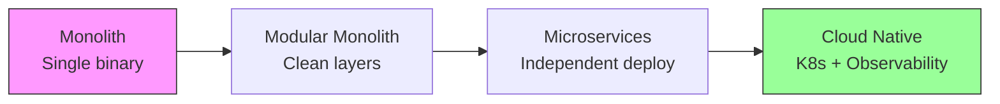
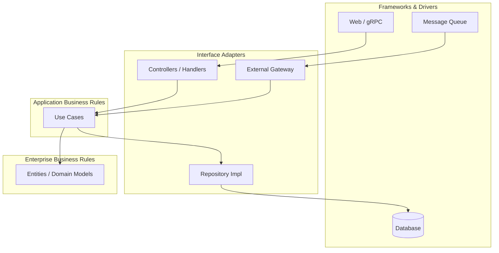
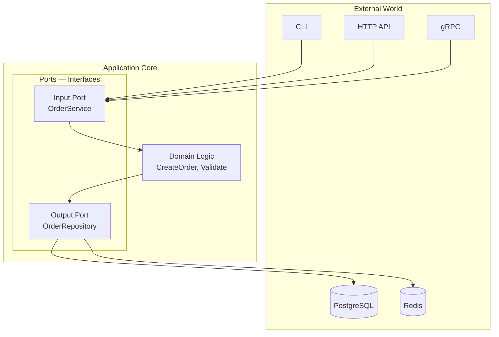
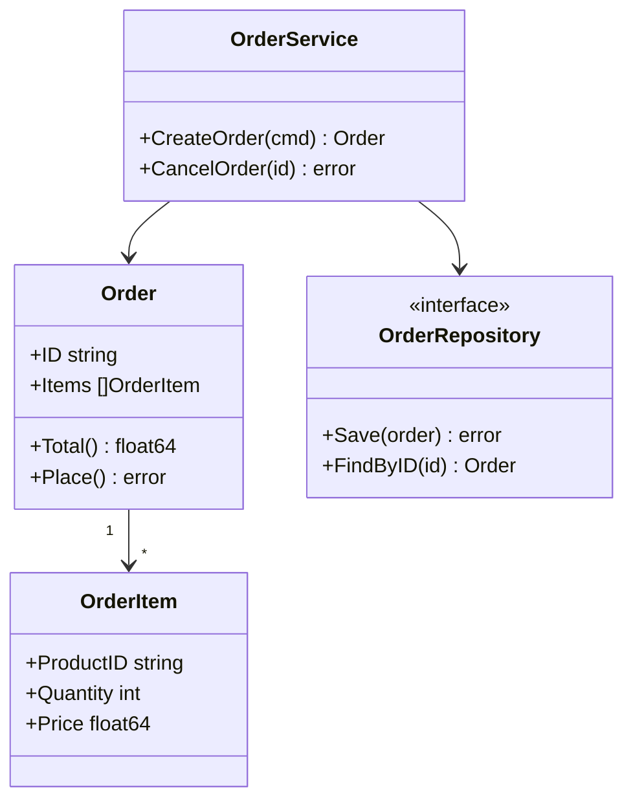
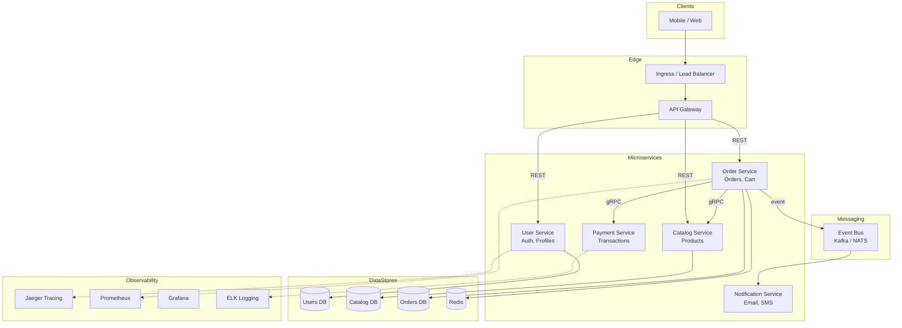
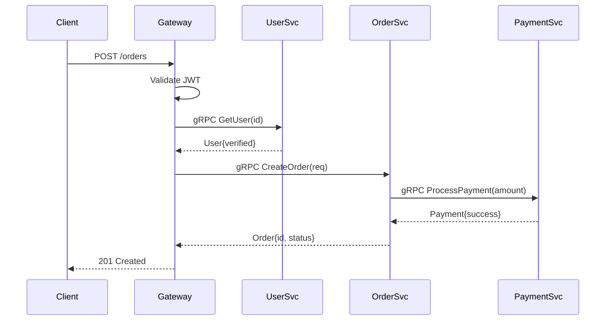
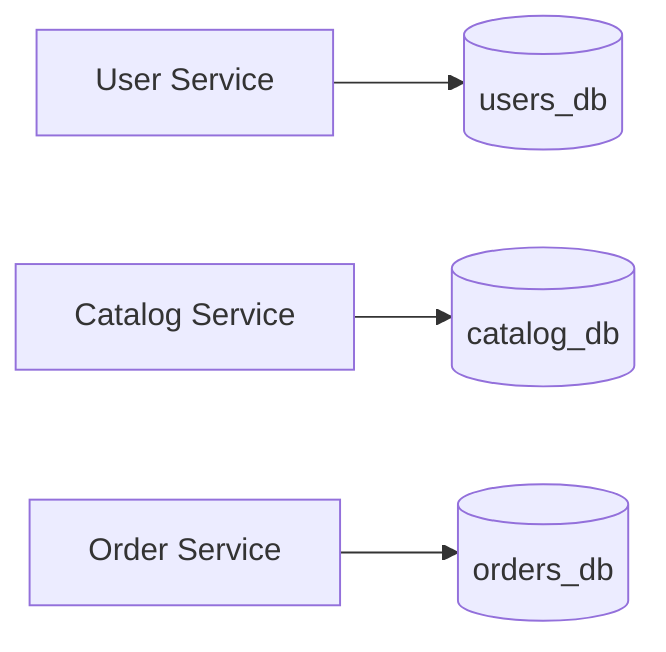
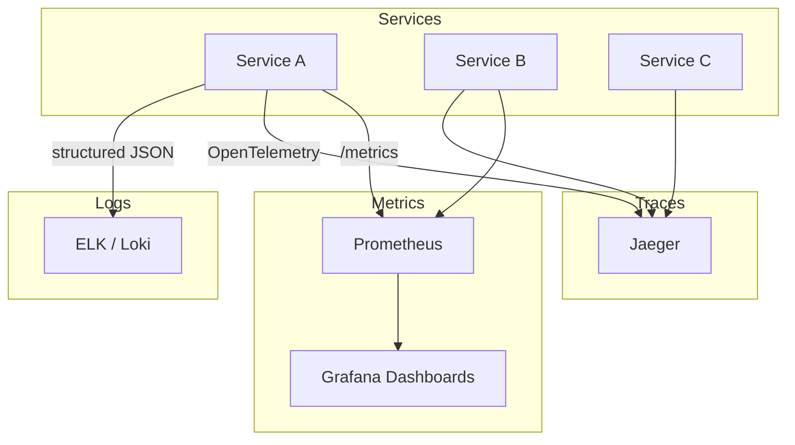
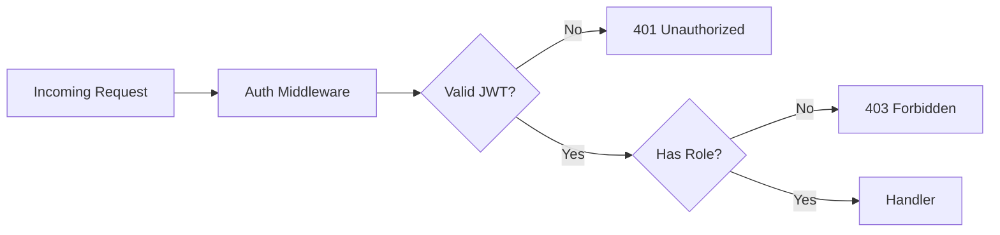
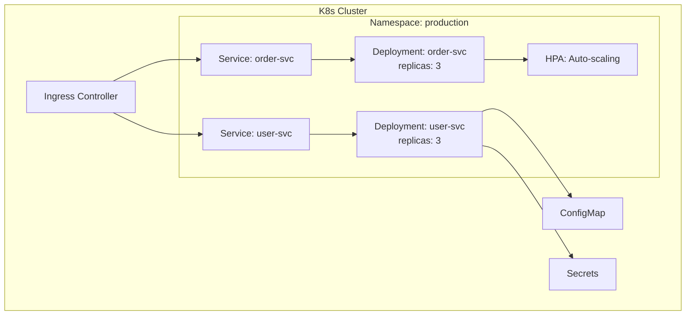

# Backend Architecture Guide

Industry-standard patterns used in this learning platform.
Module **09** has runnable code; this document explains the **full picture**.

---

## Architecture Evolution



| Stage | When to Use | Go Advantage |
| :--- | :--- | :--- |
| Monolith | MVP, small team | Fast compile, single binary |
| Modular Monolith | Growing codebase | Package boundaries, easy refactor |
| Microservices | Scale teams independently | Small images, gRPC performance |
| Cloud Native | Production at scale | Excellent K8s support |

---

## Clean Architecture

Separates business logic from frameworks, databases, and UI.



### Dependency Rule

**Dependencies point inward only.** Inner layers never import outer layers.

```
Entities  ←  Use Cases  ←  Interface Adapters  ←  Frameworks
(core)        (app logic)    (handlers, repos)      (gin, postgres)
```

### Go Project Layout

```
my-service/
├── cmd/
│   └── api/
│       └── main.go          # Entry point, wiring
├── internal/
│   ├── domain/              # Entities, business rules
│   │   └── order.go
│   ├── usecase/             # Application logic
│   │   └── order_service.go
│   ├── adapter/
│   │   ├── handler/         # HTTP/gRPC handlers (primary adapter)
│   │   │   └── order_handler.go
│   │   └── repository/      # DB implementations (secondary adapter)
│   │       └── postgres_order_repo.go
│   └── port/                # Interfaces (contracts)
│       └── order_repository.go
├── pkg/                     # Shared, importable packages
└── go.mod
```

---

## Hexagonal Architecture (Ports & Adapters)

Same idea as Clean Architecture, different naming.



**Runnable example:** `09_backend_architecture/main.go`

---

## Domain-Driven Design (DDD) — Essentials



### DDD Building Blocks

| Concept | Description | Go Example |
| :--- | :--- | :--- |
| **Entity** | Object with identity | `type Order struct { ID string }` |
| **Value Object** | Immutable, no identity | `type Money struct { Amount int; Currency string }` |
| **Aggregate** | Cluster of entities | Order + OrderItems |
| **Repository** | Persistence abstraction | `OrderRepository` interface |
| **Service** | Domain logic across entities | `OrderService` |

---

## Microservices Architecture (Capstone)

Full e-commerce backend from Module 15.



### Communication Patterns

| Pattern | Use Case | Protocol |
| :--- | :--- | :--- |
| **Sync Request-Response** | Get user profile, place order | REST / gRPC |
| **Async Event-Driven** | Order placed → send email | Kafka, NATS, RabbitMQ |
| **CQRS** | Separate read/write models | Event sourcing + projections |
| **Saga** | Distributed transactions | Choreography or orchestration |

---

## API Gateway Pattern



---

## Data Management

### Database per Service

Each microservice owns its database. No shared tables.



### Caching Strategy

```
Read:  Client → Redis (hit?) → PostgreSQL (miss) → populate Redis
Write: Client → PostgreSQL → invalidate Redis key
```

---

## Observability Stack



### Go Libraries

| Concern | Library |
| :--- | :--- |
| Structured logging | `log/slog`, `zerolog`, `zap` |
| Tracing | `go.opentelemetry.io/otel` |
| Metrics | `prometheus/client_golang` |

---

## Security Architecture



See Module 07: `07_authentication_and_security/`

---

## Deployment Architecture (Kubernetes)



See Module 13: `13_docker_and_kubernetes/`

---

## Architecture Decision Checklist

Before building, answer these:

- [ ] Monolith or microservices? (Start monolith unless you have a clear split)
- [ ] Sync (gRPC/REST) or async (events) for each interaction?
- [ ] Which database per service?
- [ ] How will you handle distributed failures? (retries, circuit breakers)
- [ ] How will you trace requests across services?
- [ ] How will you deploy? (Docker → K8s → CI/CD)

---

## Related Docs

- [MICROSERVICES.md](./MICROSERVICES.md) — gRPC, service mesh, patterns
- [LEARNING_PATH.md](./LEARNING_PATH.md) — module order
- [Module 09 code](../09_backend_architecture/main.go) — hexagonal example
