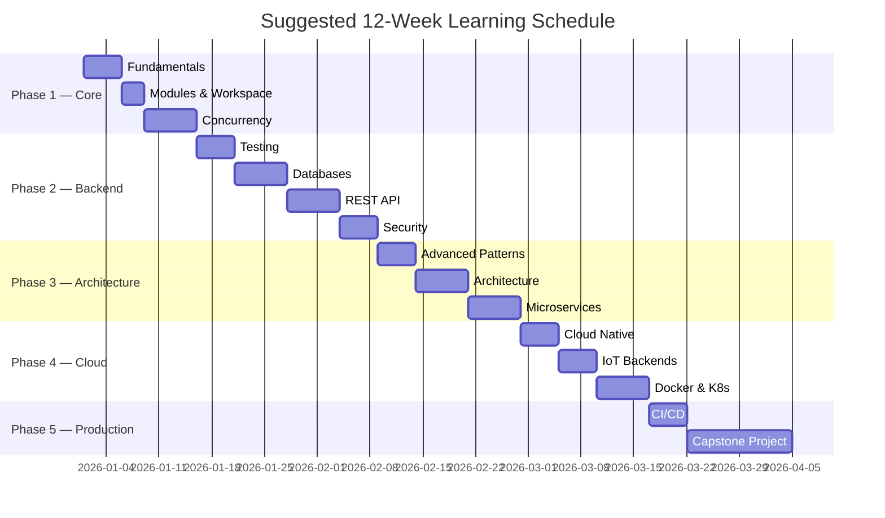

# Go Learning Path — A to Z

Complete roadmap from **zero Go knowledge** to **production-ready backend architect**.
Follow modules in order. Each step builds on the previous one.

---

## Path Overview



> Schedule is flexible. Spend more time on modules you find difficult.

---

## Phase 1: Core Go (Week 1–2)

### Module 01 — Go Fundamentals
**Folder:** `01_go_fundamentals/`

**You will learn:**
- Variables, zero values, constants
- Control flow (`if`, `switch`, `for`)
- Functions, multiple returns, closures
- Pointers, structs, interfaces
- Error handling (`if err != nil`)

**Run:**
```bash
cd 01_go_fundamentals && go run main.go
```

**Checkpoint:** Explain the difference between a struct and an interface in Go.

---

### Module 02 — Modules & Workspace
**Folder:** `02_modules_and_workspace/`

**You will learn:**
- `go mod init`, `go get`, `go mod tidy`
- Semantic versioning
- Multi-module workspaces (`go.work`)

**Checkpoint:** Create a new module and add an external dependency.

---

### Module 03 — Concurrency & Context
**Folder:** `03_concurrency_and_context/`

**You will learn:**
- Goroutines and channels
- `sync.WaitGroup`, `sync.Mutex`
- `select` statement
- `context.Context` for cancellation and timeouts
- Worker pool pattern

**Checkpoint:** Build a worker pool that processes 100 jobs with 5 workers.

---

## Phase 2: Backend Engineering (Week 3–5)

### Module 04 — Testing & Debugging
**Folder:** `04_testing_and_debugging/`

**You will learn:**
- Table-driven tests
- `testing` package, subtests
- Benchmarks (`go test -bench`)
- Fuzzing basics

**Checkpoint:** Write tests with >80% coverage for a sample function.

---

### Module 05 — Databases
**Folder:** `05_databases_sql_nosql/`

**You will learn:**
- `database/sql` with PostgreSQL
- GORM ORM basics
- Redis for caching
- Migration strategies

**Checkpoint:** CRUD operations with proper connection pooling.

---

### Module 06 — REST API & Gin
**Folder:** `06_rest_api_and_gin/`

**You will learn:**
- REST principles (resources, HTTP verbs, status codes)
- Gin router, handlers, middleware
- JSON binding and validation
- Health check endpoints

**Checkpoint:** Build a CRUD API for a resource (e.g., books, users).

---

### Module 07 — Authentication & Security
**Folder:** `07_authentication_and_security/`

**You will learn:**
- JWT token generation and validation
- Password hashing (bcrypt)
- OAuth2 flow overview
- RBAC (Role-Based Access Control)

**Checkpoint:** Protect an API endpoint with JWT middleware.

---

## Phase 3: Architecture & Microservices (Week 6–8)

### Module 08 — Advanced Go Patterns
**Folder:** `08_advanced_go_patterns/`

**You will learn:**
- Generics (`[T any]`)
- Functional options pattern
- Middleware chaining
- Reflection (when and when not to use)

**Checkpoint:** Implement a service using the functional options pattern.

---

### Module 09 — Backend Architecture
**Folder:** `09_backend_architecture/`

**You will learn:**
- Clean Architecture (Uncle Bob)
- Hexagonal Architecture (Ports & Adapters)
- Domain-Driven Design basics
- Dependency Injection

**Run:**
```bash
cd 09_backend_architecture && go run main.go
```

**Checkpoint:** Draw the layers of your app: Domain → Use Case → Adapter.

See also: [ARCHITECTURE.md](./ARCHITECTURE.md)

---

### Module 10 — Microservices
**Folder:** `10_microservices/`

**You will learn:**
- gRPC vs REST
- Protocol Buffers (`.proto` files)
- gRPC server and client
- Service discovery concepts
- Circuit breaker pattern

**Run:**
```bash
# Terminal 1
cd 10_microservices && go run server/main.go
# Terminal 2
go run client/main.go
```

**Checkpoint:** Define a `.proto` file and generate Go code with `protoc`.

See also: [MICROSERVICES.md](./MICROSERVICES.md)

---

## Phase 4: Cloud Native & IoT (Week 9–10)

### Module 11 — Cloud Native Go
**Folder:** `11_cloud_native_go/`

**You will learn:**
- AWS/GCP SDK basics
- Cloud Functions / Lambda in Go
- Object storage (S3/GCS)
- Environment-based configuration

---

### Module 12 — IoT Backends
**Folder:** `12_iot_backend_projects/`

**You will learn:**
- MQTT protocol (Eclipse Paho)
- Sensor data ingestion
- Real-time data pipelines
- WebSocket dashboards

---

### Module 13 — Docker & Kubernetes
**Folder:** `13_docker_and_kubernetes/`

**You will learn:**
- Multi-stage Dockerfiles for Go
- Docker Compose for local dev
- Kubernetes Deployments, Services, Ingress
- Health probes (liveness, readiness)

**Run:**
```bash
cd 13_docker_and_kubernetes
docker build -t my-go-app .
```

---

## Phase 5: DevOps & Capstone (Week 11–12)

### Module 14 — CI/CD Pipeline
**Folder:** `14_ci_cd_pipeline/`

**You will learn:**
- GitHub Actions workflows
- `golangci-lint` integration
- Automated testing on push
- Release engineering

---

### Module 15 — Capstone Projects
**Folder:** `15_capstone_projects/`

**Choose one:**

| Project | Difficulty | Skills Demonstrated |
| :--- | :---: | :--- |
| E-Commerce Microservices | Hard | gRPC, PostgreSQL, Redis, K8s, tracing |
| IoT Data Platform | Hard | MQTT, worker pools, TimescaleDB, Grafana |

**This is your portfolio piece.** Recruiters will look at this.

---

## Learning Tips

1. **Type every example** — don't just read code
2. **Run `go test` after each module** — verify understanding
3. **Use [PROGRESS.md](./PROGRESS.md)** — check off completed modules
4. **Fork the repo** — commit your exercises so recruiters see your journey
5. **Explain out loud** — if you can teach it, you know it

---

## Next Steps

- [Track your progress →](./PROGRESS.md)
- [View skills matrix →](./SKILLS_MATRIX.md)
- [Read architecture guide →](./ARCHITECTURE.md)
- [Start Module 01 →](../01_go_fundamentals/README.md)
