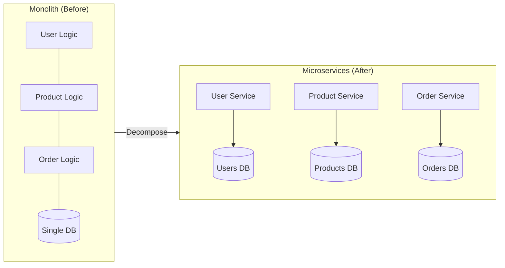
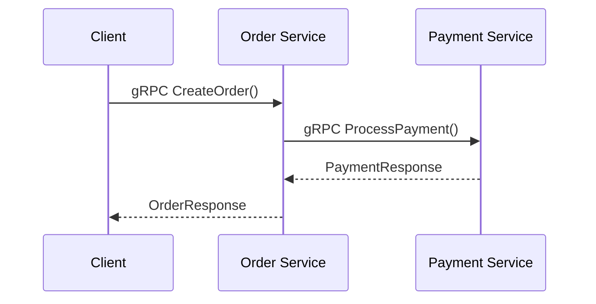
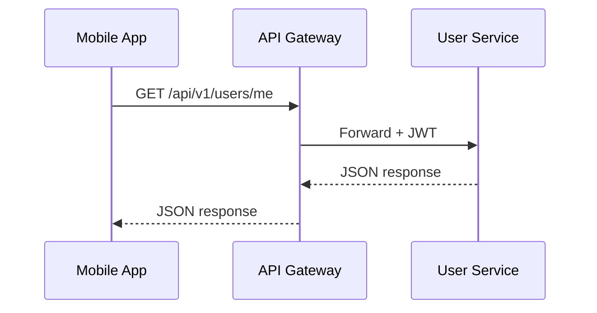
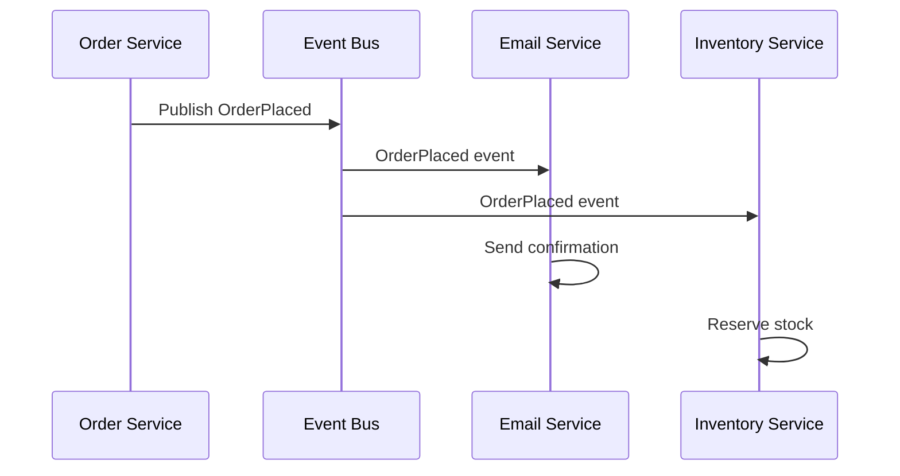
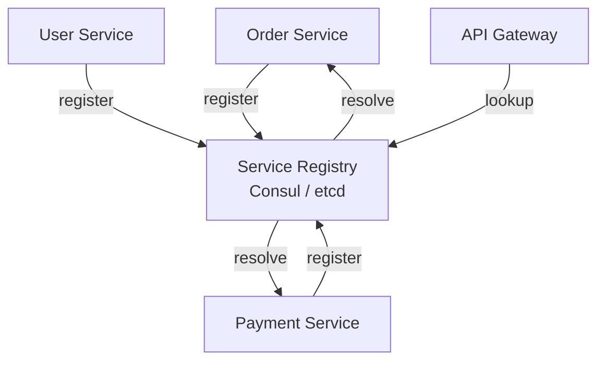
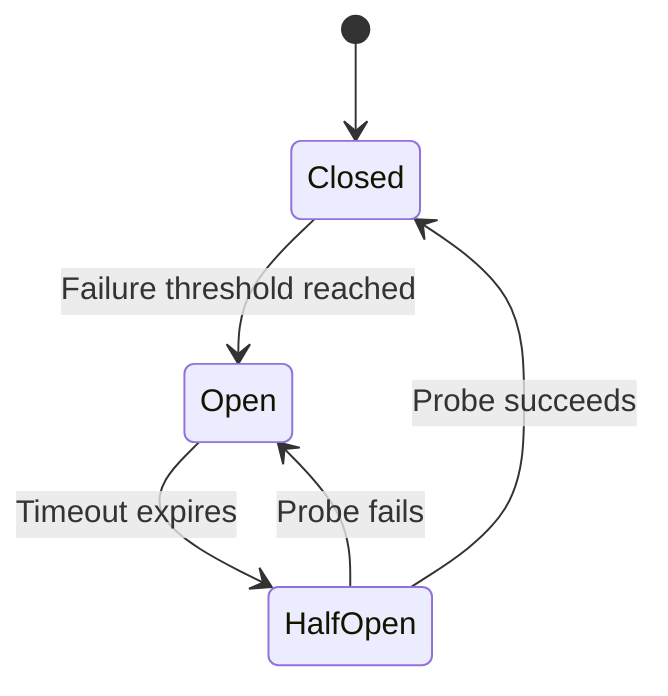
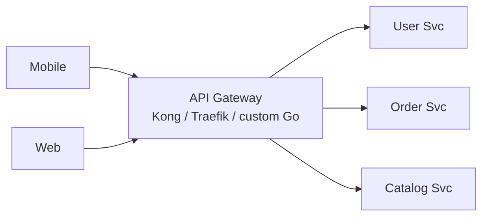
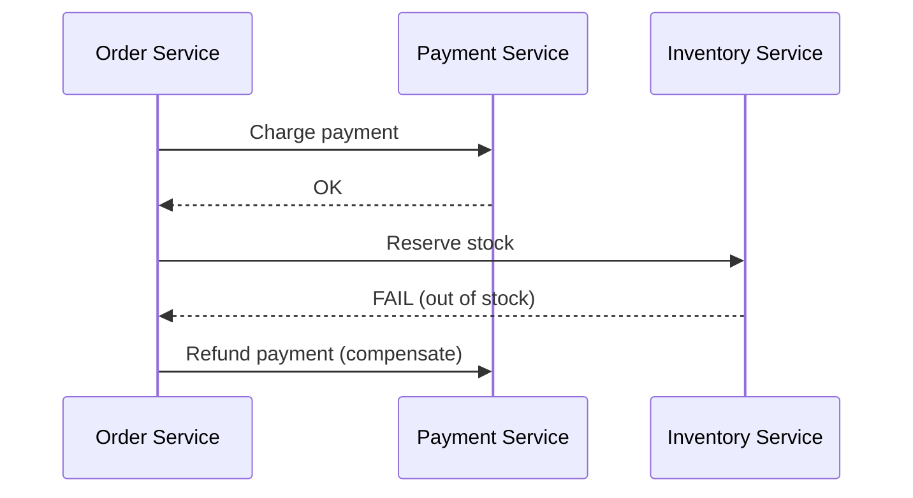
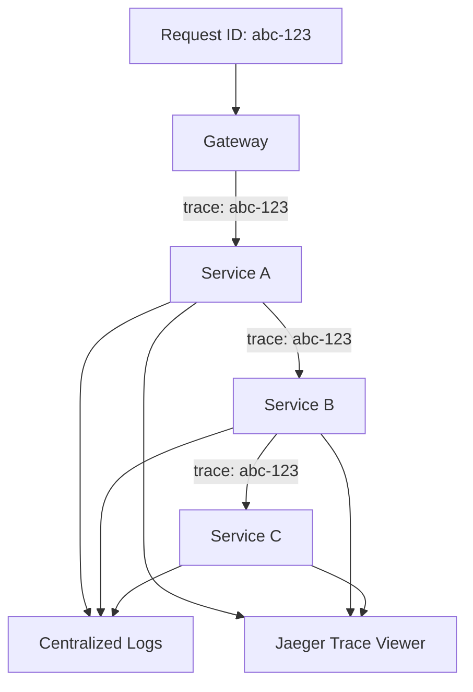

# Microservices with Go — Complete Guide

Everything you need to design, build, and deploy microservices in Go.
Module **10** has runnable gRPC code; this guide covers the full A→Z picture.

---

## What Are Microservices?



| Aspect | Monolith | Microservices |
| :--- | :--- | :--- |
| Deployment | All-or-nothing | Independent per service |
| Scaling | Scale entire app | Scale hot services only |
| Technology | One stack | Polyglot possible |
| Complexity | Lower initially | Higher — needs DevOps maturity |
| Go fit | Excellent for start | Excellent — small binaries, fast startup |

---

## When to Use Microservices

**Use when:**
- Team is large enough to own separate services (2-pizza rule)
- Different parts scale differently (orders spike, catalog doesn't)
- You need independent deployment cycles

**Don't use when:**
- Early startup / MVP stage
- Team < 5 engineers
- You haven't mastered a modular monolith first

---

## Communication Patterns

### 1. Synchronous — gRPC (Recommended for internal)



**Why gRPC over REST internally:**
- Binary Protocol Buffers — smaller, faster
- Strong typing via `.proto` contracts
- Built-in streaming (unary, server, client, bidirectional)
- Native Go support

### 2. Synchronous — REST (Recommended for external/public APIs)



### 3. Asynchronous — Event-Driven



---

## Protocol Buffers & gRPC Setup

### Step 1: Define `.proto` Contract

```protobuf
syntax = "proto3";

package order;

option go_package = "github.com/yourname/orderservice/pb";

service OrderService {
  rpc CreateOrder(CreateOrderRequest) returns (CreateOrderResponse);
  rpc GetOrder(GetOrderRequest) returns (GetOrderResponse);
}

message CreateOrderRequest {
  string user_id = 1;
  repeated OrderItem items = 2;
}

message OrderItem {
  string product_id = 1;
  int32 quantity = 2;
}

message CreateOrderResponse {
  string order_id = 1;
  string status = 2;
}
```

### Step 2: Generate Go Code

```bash
# Install tools (once)
go install google.golang.org/protobuf/cmd/protoc-gen-go@latest
go install google.golang.org/grpc/cmd/protoc-gen-go-grpc@latest

# Generate
protoc --go_out=. --go-grpc_out=. proto/order.proto
```

### Step 3: Implement Server

```go
type orderServer struct {
    pb.UnimplementedOrderServiceServer
    repo OrderRepository
}

func (s *orderServer) CreateOrder(ctx context.Context, req *pb.CreateOrderRequest) (*pb.CreateOrderResponse, error) {
    order, err := s.repo.Save(req)
    if err != nil {
        return nil, status.Errorf(codes.Internal, "save failed: %v", err)
    }
    return &pb.CreateOrderResponse{OrderId: order.ID, Status: "created"}, nil
}
```

### Step 4: Implement Client

```go
conn, _ := grpc.Dial("order-service:50051", grpc.WithInsecure())
client := pb.NewOrderServiceClient(conn)
resp, err := client.CreateOrder(ctx, &pb.CreateOrderRequest{UserId: "u-123"})
```

**Runnable demo:** `10_microservices/server/main.go` + `client/main.go`

---

## Service Discovery



| Tool | Use Case |
| :--- | :--- |
| **Kubernetes DNS** | Built-in when running on K8s (`user-svc.default.svc.cluster.local`) |
| **Consul** | Multi-cloud, health checks, KV store |
| **etcd** | K8s uses this internally |

On Kubernetes, you usually don't need external service discovery — K8s Services handle it.

---

## Resilience Patterns

### Circuit Breaker



```go
// Using github.com/sony/gobreaker
cb := gobreaker.NewCircuitBreaker(gobreaker.Settings{
    Name:        "payment-service",
    MaxRequests: 3,
    Interval:    10 * time.Second,
    Timeout:     30 * time.Second,
})

result, err := cb.Execute(func() (interface{}, error) {
    return paymentClient.ProcessPayment(ctx, req)
})
```

### Retry with Exponential Backoff

```go
for attempt := 0; attempt < maxRetries; attempt++ {
    resp, err := client.Call(ctx, req)
    if err == nil {
        return resp, nil
    }
    time.Sleep(time.Duration(math.Pow(2, float64(attempt))) * 100 * time.Millisecond)
}
```

### Timeout via Context

```go
ctx, cancel := context.WithTimeout(context.Background(), 3*time.Second)
defer cancel()
resp, err := client.GetUser(ctx, &pb.GetUserRequest{Id: userID})
```

---

## API Gateway

Single entry point for all clients.



**Gateway responsibilities:**
- Authentication / JWT validation
- Rate limiting
- Request routing
- Response aggregation (BFF pattern)
- SSL termination

---

## Data Patterns

### Database per Service

```
user-service     → users_db (PostgreSQL)
catalog-service  → catalog_db (PostgreSQL)
order-service    → orders_db (PostgreSQL)
order-service    → cache (Redis)
```

### Saga Pattern (Distributed Transactions)



Two approaches:
- **Choreography:** Services react to events (loose coupling)
- **Orchestration:** Central saga coordinator directs steps

### CQRS (Command Query Responsibility Segregation)

```
Write side:  POST /orders → Order Service → orders_db
Read side:   GET  /orders → Order Read Model → orders_read_db (denormalized)
Sync:        OrderPlaced event → update read model
```

---

## Observability in Microservices



**Every request gets a trace ID** propagated via gRPC metadata or HTTP headers.

```go
// Propagate trace context
md := metadata.Pairs("x-trace-id", traceID)
ctx = metadata.NewOutgoingContext(ctx, md)
```

---

## Full Microservices Stack (Capstone Reference)

| Layer | Technology |
| :--- | :--- |
| Language | Go 1.22+ |
| API (external) | REST + Gin |
| API (internal) | gRPC + Protobuf |
| Database | PostgreSQL per service |
| Cache | Redis |
| Message Bus | NATS or Kafka |
| Service Mesh | Istio (optional) |
| Container | Docker multi-stage |
| Orchestration | Kubernetes |
| CI/CD | GitHub Actions |
| Logging | Structured JSON → ELK/Loki |
| Tracing | OpenTelemetry + Jaeger |
| Metrics | Prometheus + Grafana |

---

## Microservices Checklist

Before going to production:

- [ ] Each service has its own `go.mod` and Dockerfile
- [ ] Health check endpoints (`/health`, `/ready`)
- [ ] gRPC + REST contracts defined in `.proto` / OpenAPI
- [ ] Context timeouts on all external calls
- [ ] Circuit breakers on critical dependencies
- [ ] Structured logging with correlation IDs
- [ ] Distributed tracing enabled
- [ ] Database migrations automated
- [ ] CI runs tests + lint on every PR
- [ ] K8s manifests with resource limits

---

## Module Reference

| Topic | Location |
| :--- | :--- |
| gRPC server/client demo | `10_microservices/` |
| Clean architecture | `09_backend_architecture/` |
| REST API | `06_rest_api_and_gin/` |
| Auth/JWT | `07_authentication_and_security/` |
| Docker/K8s deploy | `13_docker_and_kubernetes/` |
| Capstone e-commerce | `15_capstone_projects/` |

---

## Further Reading

- [ARCHITECTURE.md](./ARCHITECTURE.md) — system design patterns
- [LEARNING_PATH.md](./LEARNING_PATH.md) — module order
- [gRPC Go Quick Start](https://grpc.io/docs/languages/go/quickstart/)
- [12-Factor App](https://12factor.net/)
