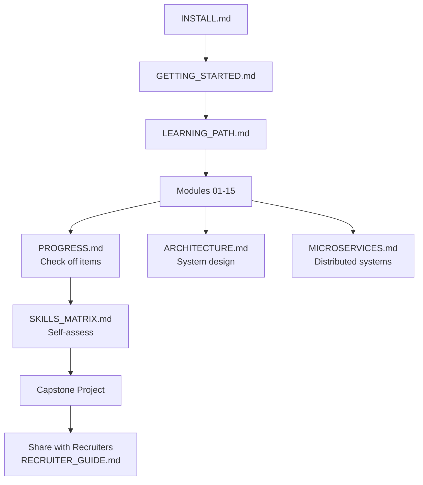

# Go Learning Documentation

Complete documentation for the **golang-learning** platform.
Start here, then follow the learning path module by module.

---

## Start Here

| Order | Document | Description |
| :---: | :--- | :--- |
| 1 | [INSTALL.md](./INSTALL.md) | Install Go (Windows-first) and verify setup |
| 2 | [GETTING_STARTED.md](./GETTING_STARTED.md) | Run, build, and test your first program |
| 3 | [LEARNING_PATH.md](./LEARNING_PATH.md) | **Complete A→Z roadmap** (15 modules) |
| 4 | [PROGRESS.md](./PROGRESS.md) | **Track your completion** — check off modules |

---

## Architecture & System Design

| Document | Description |
| :--- | :--- |
| [ARCHITECTURE.md](./ARCHITECTURE.md) | Clean Architecture, Hexagonal, DDD, full system diagrams |
| [MICROSERVICES.md](./MICROSERVICES.md) | gRPC, event-driven, resilience patterns, observability |
| [PROJECT_STRUCTURE.md](./PROJECT_STRUCTURE.md) | Go project layout best practices |

---

## For Learners & Recruiters

| Document | Audience | Description |
| :--- | :--- | :--- |
| [PROGRESS.md](./PROGRESS.md) | Learners | Module completion checklist |
| [SKILLS_MATRIX.md](./SKILLS_MATRIX.md) | Both | Skill-to-module mapping with interview questions |
| [RECRUITER_GUIDE.md](./RECRUITER_GUIDE.md) | Recruiters | How to evaluate candidates using this repo |

---

## Reference Guides

| Document | Description |
| :--- | :--- |
| [BASICS.md](./BASICS.md) | Syntax, variables, control flow |
| [MODULES.md](./MODULES.md) | Go modules and dependency management |
| [TOOLS.md](./TOOLS.md) | Editor setup, useful CLI tools |
| [TESTING.md](./TESTING.md) | Writing tests and benchmarks |
| [ADVANCED.md](./ADVANCED.md) | Concurrency, interfaces, error handling |
| [DEPLOY.md](./DEPLOY.md) | Building and cross-compiling |
| [CHEAT_SHEET.md](./CHEAT_SHEET.md) | Quick command reference |
| [RESOURCES.md](./RESOURCES.md) | External links and further learning |

---

## Learning Flow

---

## Quick Links to Modules

| Phase | Modules |
| :--- | :--- |
| Core Go | [01](../01_go_fundamentals) · [02](../02_modules_and_workspace) · [03](../03_concurrency_and_context) |
| Backend | [04](../04_testing_and_debugging) · [05](../05_databases_sql_nosql) · [06](../06_rest_api_and_gin) · [07](../07_authentication_and_security) |
| Architecture | [08](../08_advanced_go_patterns) · [09](../09_backend_architecture) · [10](../10_microservices) |
| Cloud & IoT | [11](../11_cloud_native_go) · [12](../12_iot_backend_projects) · [13](../13_docker_and_kubernetes) |
| DevOps | [14](../14_ci_cd_pipeline) · [15](../15_capstone_projects) |
