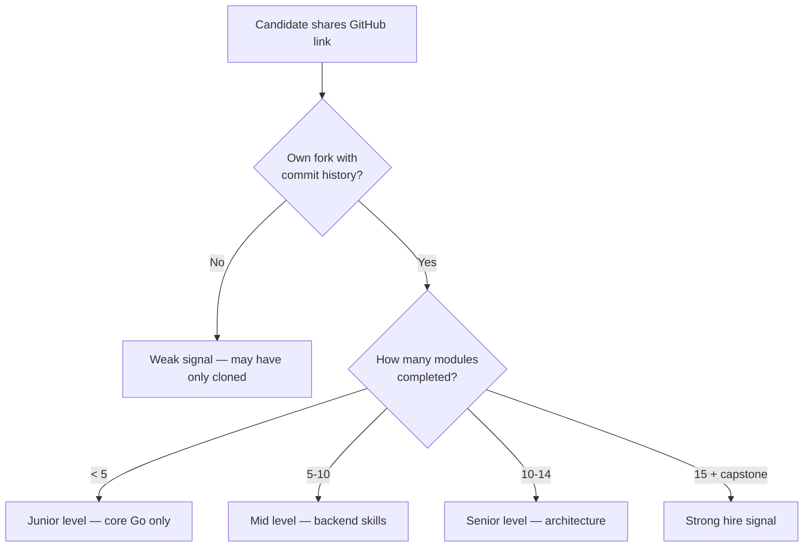
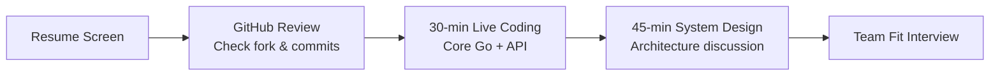

# Recruiter & Hiring Manager Guide

How to evaluate whether a candidate has genuinely learned Go using this repository.

---

## What This Repo Proves

This is not a tutorial you "complete" by reading. It is a **structured learning platform** with:

- 15 modules of runnable Go code
- Architecture and microservices documentation
- Capstone projects for portfolio demonstration
- Progress tracking and skills matrix

A strong candidate will have **their own fork** with commits, completed exercises, and ideally a capstone project.

---

## Quick Evaluation (5 Minutes)



### Red Flags

- Repo forked but zero commits
- Cannot run any module (`go run main.go` fails for them)
- Cannot explain code they claim to have written
- No understanding of error handling (`if err != nil`)
- Confuses goroutines with OS threads

### Green Flags

- Consistent commit history over weeks/months
- Custom exercises or extensions beyond the base code
- Capstone project with multiple services
- Can draw architecture diagrams from memory
- Mentions trade-offs (gRPC vs REST, when to use microservices)

---

## Evaluation by Role

### Junior Go Developer

**Ask them to:**
1. Run `01_go_fundamentals/main.go` and explain output
2. Write a function that returns an error for invalid input
3. Explain what a goroutine is
4. Build a simple REST endpoint with Gin (module 06)

**Expected modules completed:** 01–06

**Key questions:**
- "What is the zero value of an `int` in Go?"
- "Why doesn't Go have a `while` loop?"
- "How do you handle errors in Go?"

---

### Mid-Level Go Developer

**Ask them to:**
1. Walk through `09_backend_architecture/main.go` — explain ports and adapters
2. Write a table-driven test for a business function
3. Explain JWT flow from module 07
4. Design a CRUD API with proper status codes

**Expected modules completed:** 01–10

**Key questions:**
- "Explain the difference between a struct and an interface in Go."
- "How would you add caching to a database query?"
- "What is dependency injection and why use it?"

---

### Senior Go Developer / Architect

**Ask them to:**
1. Draw the microservices architecture from [ARCHITECTURE.md](./ARCHITECTURE.md) on a whiteboard
2. Explain when to use gRPC vs REST vs events
3. Describe how they would handle a distributed transaction (saga)
4. Walk through their capstone project architecture

**Expected modules completed:** 01–15

**Key questions:**
- "When should you NOT use microservices?"
- "How do you trace a request across 5 services?"
- "Explain circuit breaker pattern and when it helps."
- "How would you deploy this on Kubernetes with zero downtime?"

---

## What to Look for in Their Fork

| Signal | What It Means | How to Verify |
| :--- | :--- | :--- |
| **Commit history** | Genuine learning journey | `git log --oneline` shows progression |
| **Custom code** | Goes beyond copy-paste | New files, modified examples |
| **Tests written** | Quality mindset | `go test ./...` passes |
| **CI badge** | Automation skills | Green GitHub Actions on their fork |
| **Capstone repo** | Production readiness | Separate repo with multi-service app |
| **README updates** | Communication skills | Their fork README has personal notes |

---

## Live Coding Assessment (30 Minutes)

### Part 1: Core Go (10 min)

```
Task: Write a function that reads a CSV file and returns
      the count of rows per category.

Evaluate: error handling, file I/O, map usage, testing instinct
```

### Part 2: API Design (10 min)

```
Task: Design REST endpoints for a simple todo app.
      Implement one endpoint with Gin.

Evaluate: HTTP verbs, status codes, JSON binding, route structure
```

### Part 3: Architecture Discussion (10 min)

```
Task: "Design a URL shortener service. Monolith or microservices?
       What database? How to handle 1M requests/day?"

Evaluate: system thinking, trade-off analysis, Go-specific advantages
```

---

## Module-to-Skill Verification Table

Use this during interviews to map answers to proven skills:

| If they can explain... | They likely completed... | Hire signal |
| :--- | :---: | :---: |
| Zero values, error handling | Module 01 | Junior+ |
| Goroutines, channels, worker pools | Module 03 | Junior+ |
| Table-driven tests, benchmarks | Module 04 | Mid+ |
| JWT, bcrypt, middleware | Module 07 | Mid+ |
| Hexagonal architecture, DI | Module 09 | Mid+ |
| gRPC, protobuf, circuit breaker | Module 10 | Senior |
| K8s deployments, multi-stage Docker | Module 13 | Senior |
| Full capstone with CI/CD | Module 15 | Strong Senior |

Full matrix: [SKILLS_MATRIX.md](./SKILLS_MATRIX.md)

---

## Candidate Self-Report vs Verified Skills

Candidates may claim skills on their resume. Verify with this repo:

| Resume Claim | Verification Method |
| :--- | :--- |
| "Proficient in Go" | Live code module 01–03 exercises |
| "Built REST APIs" | Demo module 06, ask about middleware |
| "Microservices experience" | Whiteboard architecture from module 10/15 |
| "Kubernetes deployment" | Show module 13 manifests, explain probes |
| "CI/CD experience" | Show module 14 workflow, explain stages |

---

## Recommended Hiring Process



1. **Resume screen** — look for Go experience, backend roles
2. **GitHub review** — check their fork of this repo (or similar projects)
3. **Live coding** — modules 01, 04, 06 level tasks
4. **System design** — modules 09, 10, 15 level discussion
5. **Team fit** — collaboration, communication

---

## Sample Evaluation Scorecard

| Criteria | Weight | Score (1-5) | Notes |
| :--- | :---: | :---: | :--- |
| Core Go proficiency | 25% | | |
| Backend/API skills | 25% | | |
| Architecture understanding | 20% | | |
| Testing & quality | 15% | | |
| DevOps & deployment | 15% | | |
| **Total** | 100% | | |

| Total Score | Recommendation |
| :---: | :--- |
| 4.0+ | Strong hire |
| 3.0–3.9 | Hire with mentorship |
| 2.0–2.9 | No hire (junior potential) |
| < 2.0 | No hire |

---

## FAQ for Recruiters

**Q: Is completing this repo equivalent to X years of experience?**
A: Completing all 15 modules + capstone ≈ 0–2 years focused Go backend experience, depending on depth. Real production experience still matters.

**Q: Can I use this repo as a take-home assignment?**
A: Yes. Ask candidates to complete modules 01–06 and build a small API. Set a 1-week deadline.

**Q: How do I know they didn't use AI to complete it?**
A: Live coding and architecture discussion reveal true understanding. Ask "why" questions, not just "what."

**Q: What if they have a different learning repo?**
A: Use the same evaluation framework — check commits, runnable code, architecture understanding.

---

## Related Docs

- [SKILLS_MATRIX.md](./SKILLS_MATRIX.md) — detailed skill mapping
- [PROGRESS.md](./PROGRESS.md) — what "complete" looks like
- [ARCHITECTURE.md](./ARCHITECTURE.md) — system design reference for interviews
